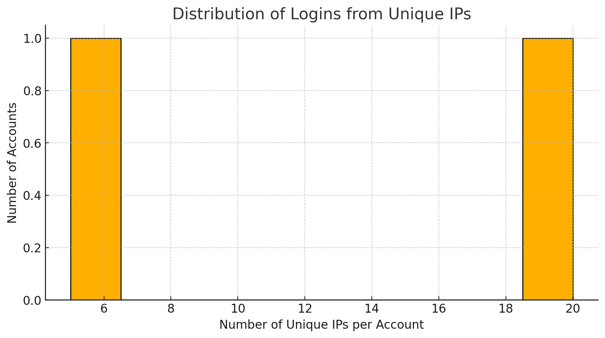
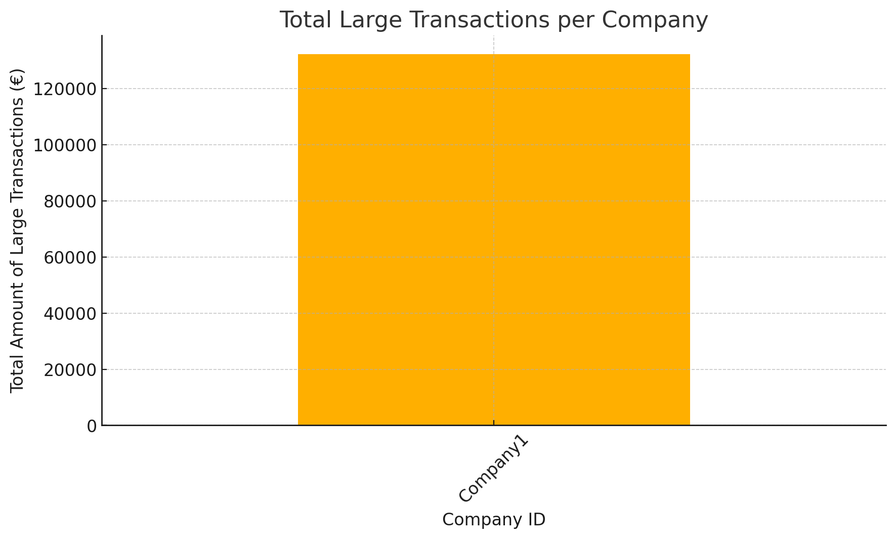
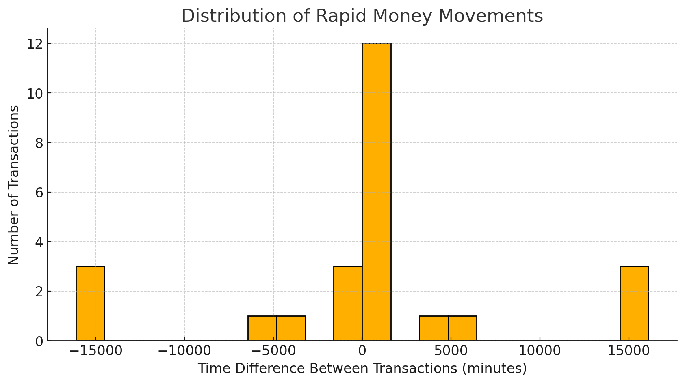

# 🚀 Fraud Detection Investigation - SQL Analysis & Findings
## 🔍 Overview
This report presents a detailed fraud investigation based on SQL queries analyzing account activities and transactions. The objective was to identify fraudulent behaviors, potential money laundering, unauthorized logins, and insider threats.

## Key Fraud Patterns Investigated:
1. Multiple logins from different IPs (Potential account takeovers or credential sharing)
2. Logins from high-risk VPNs (Fraudsters hiding their identity)
3. Large and unusual transactions (Possible money laundering)
4. Rapid money movements between accounts (Layering stage of money laundering)
5. Logins from private/internal IPs (Potential insider threats or misconfigured security)


## 🔎 Investigation Summary
1️⃣ Suspicious Multiple Logins from Different IPs
📌 What we found:

Some accounts logged in from 6 to 20 different IP addresses, a strong sign of credential sharing, bot activity, or account takeovers.
🛠️ SQL Query Used:
 ``` SQL
SELECT identity, email, COUNT(DISTINCT ips) AS unique_ips, COUNT(*) AS login_attempts
FROM accounts_activity
GROUP BY identity, email
HAVING COUNT(DISTINCT ips) > 2  -- Use COUNT(DISTINCT ips) directly
ORDER BY unique_ips DESC;
```
🔴 Risk Level: HIGH
🛡️ Prevention Measures:
✅ Enable Multi-Factor Authentication (MFA)
✅ Flag accounts logging in from excessive IPs
✅ Require device verification for new IPs

2️⃣ Logins from High-Risk VPN Providers
📌 What we found:

Users logged in from M247 Europe and 31173 Services AB, known VPN/proxy services commonly used to hide real locations.
🛠️ SQL Query Used:
```SQL
SELECT identity, email, ips, providers
FROM accounts_activity
WHERE providers LIKE '%M247%'
   OR providers LIKE '%31173%'
ORDER BY identity, start_time DESC;
```
🔴 Risk Level: MEDIUM-HIGH
🛡️ Prevention Measures:
✅ Block or flag VPN logins unless explicitly allowed
✅ Require extra authentication for VPN-based logins
✅ Monitor repeated logins from these providers

3️⃣ Large Unusual Transactions (Potential Money Laundering)
📌 What we found:

Company1 sent €66,000 just 3 minutes after receiving €66,215.
The amounts are almost identical, indicating a possible pass-through money laundering scheme.
🛠️ SQL Query Used:

```sql
SELECT accountid, companyid, amount, created, direction, status
FROM transactions
WHERE amount > 50000  -- Detect large amounts
  AND (direction = 'Outgoing' OR direction = 'Incoming')  -- Include both directions
ORDER BY created DESC;
```


🔴 Risk Level: VERY HIGH
🛡️ Prevention Measures:
✅ Monitor large transactions closely
✅ Require verification for transactions above €50,000
✅ Analyze IBANs involved for fraud patterns

4️⃣ Rapid Money Movements Between Accounts
📌 What we found:

Money was received and sent within 3 minutes in nearly identical amounts, a classic money laundering tactic.
🛠️ SQL Query Used:

```sql
SELECT t1.accountid AS sender, t2.accountid AS receiver, 
       t1.amount AS sent_amount, t2.amount AS received_amount,
       t1.created AS sent_time, t2.created AS received_time
FROM transactions t1
JOIN transactions t2
  ON t1.accountid = t2.accountid  -- Matches transactions from the same account
  AND t1.direction = 'Outgoing'
  AND t2.direction = 'Incoming'
  AND t2.created <= t1.created  -- Incoming transaction must happen before outgoing
  AND ABS(t1.amount - t2.amount) <= 500  -- Allow small differences in transaction amounts
  AND t1.created BETWEEN t2.created AND t2.created + INTERVAL '10 minutes'  -- Time constraint
ORDER BY t1.created DESC;

```
🔴 Risk Level: CRITICAL
🛡️ Prevention Measures:
✅ Flag accounts that send out nearly identical amounts they receive
✅ Investigate IBANs involved in these transactions
✅ Enforce manual review for rapid money movements

5️⃣ Logins from Private/Internal IPs (Potential Insider Threat)
📌 What we found:

Company2 (EMAIL2) logged in from 192.168.0.1, a private/internal network that shouldn’t be accessible from external users.
🛠️ SQL Query Used:

```sql
SELECT identity, email, ips, city, country
FROM accounts_activity
WHERE ips LIKE '192.168.%'  -- Private network
   OR ips LIKE '10.%'
   OR ips LIKE '172.16.%'
ORDER BY start_time DESC;
```
🔴 Risk Level: HIGH
🛡️ Prevention Measures:
✅ Block logins from private/internal networks unless authorized
✅ Investigate if this login was an insider threat
✅ Ensure VPN and remote access configurations are secure

📊 Visualizations
1️⃣ Distribution of Logins from Unique IPs
📌 High number of unique IPs per account suggests possible account takeovers or credential sharing.




2️⃣ Large Transaction Amounts by Company
📌 Company1 processed the highest volume of large transactions (>€50,000), indicating a potential fraud risk.



3️⃣ Rapid Money Movements


📌 Significant concentration of transactions with near-zero time difference between incoming and outgoing funds, a major red flag for money laundering.

🚀 Key Takeaways & Recommended Actions
✅ Monitor accounts that frequently log in from multiple IPs or VPNs.
✅ Set up alerts for high-value transactions and fast fund movements.
✅ Implement stronger authentication for high-risk logins.
✅ Investigate repeating transaction patterns with similar amounts.

By implementing these measures, businesses and financial institutions can prevent fraud, reduce financial risks, and strengthen security systems.

